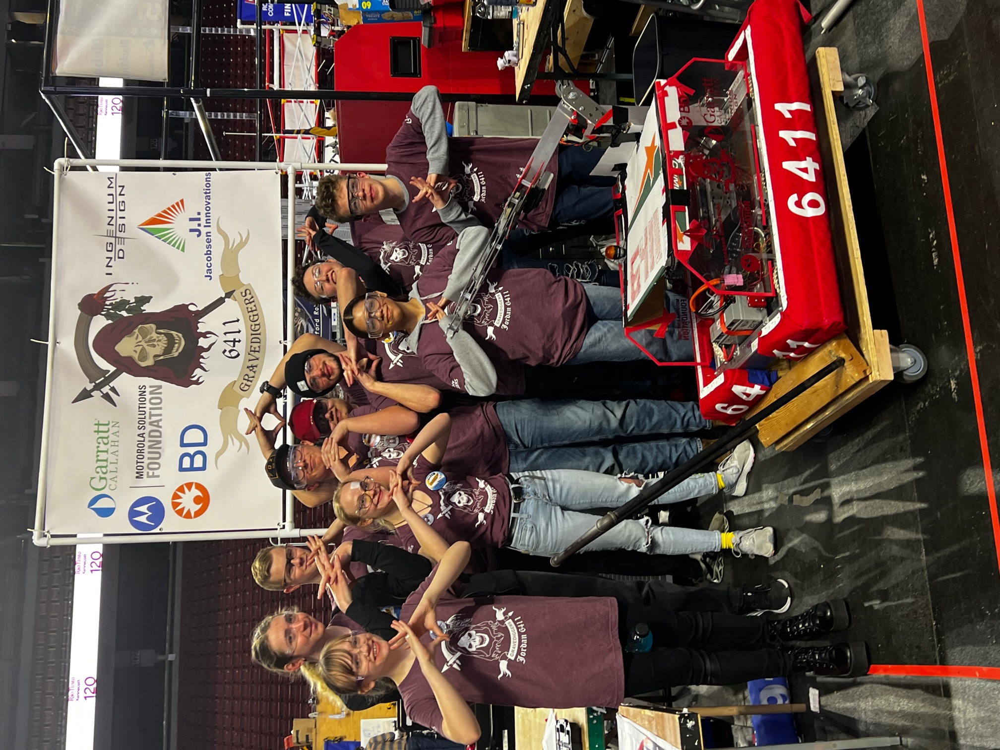

# Robot Code for 2023 Competition
This is the repository containing all the code for our 2023 FRC competition robot. This robot was designed to take cones and cubes and store them in their designated point-scoring areas. Doing so with a single, fully articulating arm powered by two motors. This robot was also programmed to use a gyroscope to balance on the charging station autonomously. Ultimately, these features made us place well in the competition and make it to the final team selection.

